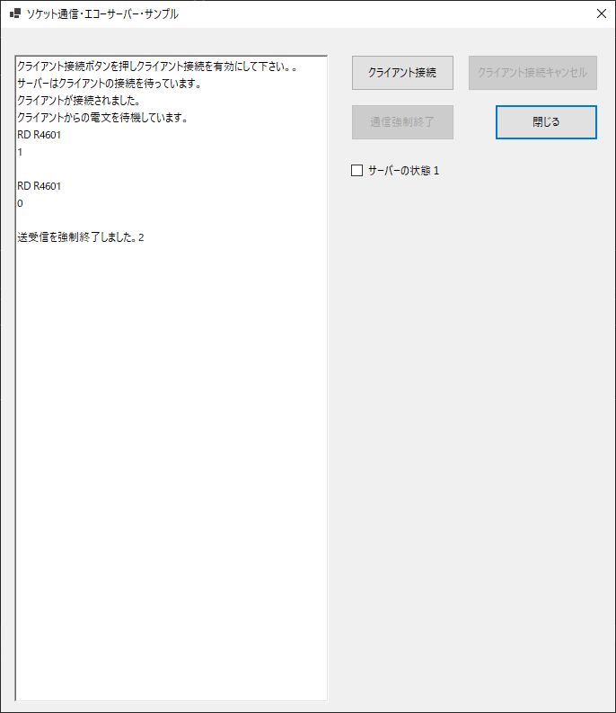

## :computer: ソケット通信(TCP)・エコーサーバー/サンプル  

### 環境  

```
開発環境：Microsoft Visual Studio 2019 Community Edition 16.7.2  
言語：C#.NET 8.0  
デスクトップ：Windows Formsアプリケーション  
デベロッパーSDK：.NET Core SDK 3.1.401  
```

  

___